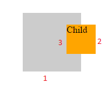

# Events 
We have a html strucure with parent and child, having 3 borders as shown below:-

Here we investigate the differences between mouseover/mouseout and mouseenter/mouseleave events.
### Mouseover and Mouseout
We have event listeners on mouse out and mouseover for both parent and child.
* If we enter and exit from border-1 we will see events mouse-over and mouse-out for parent in order
*	If we enter and exit from border-2 we will see (in order):-
    *	mouse-over child (target = child)
    *	mouse-over parent (target = child, bubble event)
    *	mouse-out child (target = child)
    *	mouse-out parent (target = child, bubble event)
* if we cross border 3 from parent to child and back, events we will see:-
    *	mouse- over parent (target = parent, due to move into child block)
    *	mouse-enter child (target = child)
    *	mouse-over parent (target = child , bubble event)
    *	mouse-out child (target = child)
    *	mouse-out parent (target = child, bubble event)
    *	mouse-over parent (target = parent, due to move into parent block from child block)	

Child target in parent event handlers demonstrates the bubbling nature of these events.

### Mouseenter and Mouseleave
We have event listeners on mouseenter and mouseleave for both parent and child.
*	If we enter and exit from border-1 we will see events mouse-enter and mouse-leave for parent in order (target = parent)
*	If we enter and exit from border-2 we will see (in order):-
   * enter child (target = child)
   * enter parent (target = parent)
   * out child (target = child)
   * out parent (target = parent)
   * Note that, target = parent for parent events, implying that there is no bubbling. 
   * The reason parent still sees the events is because child is consider as part of the parent too. 
*	if we cross border 3 from parent to child and back, events we will see
   * enter child (target = child)
   * leave child (target = child)
   * Note: there is no parent event as this event does not bubbles and as child is part of parent.

